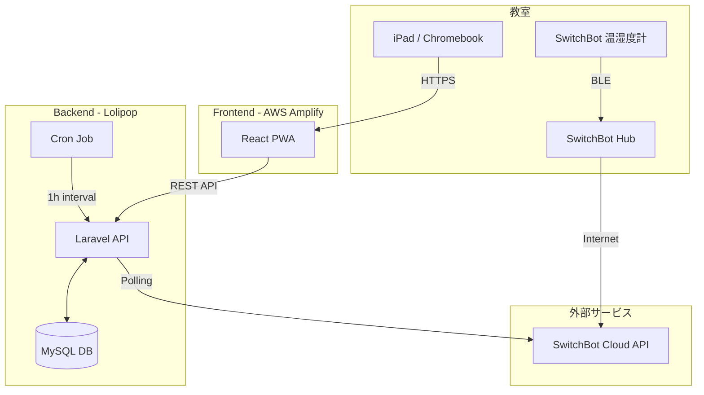

# 学校向け水耕栽培管理アプリ  SPROUT

## 📖 プロジェクト概要

教室に設置した水耕栽培キットの生育状況（室温・湿度・経過日数）を可視化し、**共有タブレット（iPad/Chromebook）** で児童と先生が共に学び、探究するための Web アプリケーション（PWA）です。

2025年8月からインターナショナルスクールでのPoC（実証実験）運用を想定しており、日々のクイズ、ToDoチェック、バッジ付与を通じて学習の定着を支援します。

### 主な目的

* **環境の可視化:** センサーデータの自動取得による生育環境の把握。
* **学習の習慣化:** クイズやToDo機能による、児童の能動的な関わりの促進。
* **共有体験:** 教室の共有端末での閲覧に最適化したUIによる、クラス全体での体験共有。

---

## 🏗 システム構成

### アーキテクチャ図



### 技術スタック

| Category | Technology |
| --- | --- |
| **Frontend** | React (TypeScript), PWA対応 |
| **Backend** | Laravel (PHP) |
| **Database** | MySQL |
| **Infrastructure** | AWS Amplify (Front), Lolipop (Back/DB) |
| **IoT / Sensor** | SwitchBot API (Meter/Hub) |
| **Target Device** | iPad (iPadOS), Chromebook (ChromeOS) |

---

## ✨ 機能一覧

### 🧑‍🎓 児童・先生向け（共有ダッシュボード）

* **環境モニタリング:** 現在の室温・湿度、適正判定、経過日数の表示。
* **グラフ表示:** 24時間の環境推移グラフ。
* **学習クイズ:** 1日1問の日替わりクイズ（クラス単位でスコア集計）。
* **今週のToDo:** 給水・清掃などの定期タスク管理。
* **バッジ機能:** 継続利用や条件達成によるゲーミフィケーション要素。

### 🛠 管理者向け

* **クラス管理:** クラス作成、ログイン用クラスコード発行。
* **デバイス管理:** 水耕栽培ベッドとSwitchBotデバイスIDの紐付け。
* **全体俯瞰:** 学校内の全教室の環境・進捗状況の一覧表示。

---

## 💻 環境構築 (Local Development)

### 1. 前提条件

* Node.js (v18+)
* PHP (v8.1+)
* Composer
* MySQL

### 2. バックエンド (Laravel)

```bash
# クローン
git clone https://github.com/your-org/hydroponics-app.git
cd hydroponics-app/backend

# 依存関係のインストール
composer install

# 環境変数の設定
cp .env.example .env
# .env を編集（DB接続情報、SWITCHBOT_TOKEN 等を設定）

# アプリケーションキーの生成
php artisan key:generate

# マイグレーション & シーディング
php artisan migrate --seed

# サーバー起動
php artisan serve

```

### 3. フロントエンド (React)

```bash
cd ../frontend

# 依存関係のインストール
npm install

# サーバー起動
npm run dev

```

### 4. バッチ処理 (Cron) Setup

本番環境では、センサーデータ取得のため以下のCron設定が必要です（毎時実行）。

```bash
# Laravelのスケジューラ登録
* * * * * cd /path-to-your-project && php artisan schedule:run >> /dev/null 2>&1

```

---

## 📂 ディレクトリ構造

```
/
├── backend/                # Laravel Project
│   ├── app/
│   │   ├── Console/Commands/  # PollSwitchBotCommand 等
│   │   ├── Http/Controllers/  # API Controllers
│   │   └── Models/            # Class, Sensor, Reading 等
│   ├── routes/api.php         # API Endpoints
│   └── database/              # Migrations & Seeds
│
└── frontend/               # React Project
    ├── src/
    │   ├── api/            # API Client (Axios)
    │   ├── components/     # UI Components (Dashboard, Graphs...)
    │   ├── pages/          # Page Components
    │   └── i18n/           # Localization
    └── public/             # Static Assets

```

---

## 🔌 API エンドポイント概要

詳細な仕様は `docs/api-spec.md` を参照してください。

| Method | Endpoint | Description |
| --- | --- | --- |
| `POST` | `/api/v1/login` | クラスコードによるログイン |
| `GET` | `/api/v1/classes/{id}/dashboard` | ダッシュボード情報一括取得 |
| `GET` | `/api/v1/classes/{id}/graphs` | グラフデータ取得 (24h/7d) |
| `POST` | `/api/v1/classes/{id}/learning/quiz/answer` | クイズ回答送信 |
| `PATCH` | `/api/v1/classes/{id}/todos/{todo_id}` | ToDoチェック更新 |
| `GET` | `/api/v1/admin/classes` | [管理者] クラス一覧取得 |

---

## 📝 運用・保守

### 認証について

* **クラス:** パスワードレスの「クラスコード」認証を採用（入力負荷軽減のため）。
* **管理者:** Email/Password 認証。

### 定期バッチ

* **Sensor Polling:** 毎時0分にSwitchBot APIからデータを取得。
* **Weekly ToDo:** 毎週月曜日に今週分のToDoリストを自動生成。

---

## 📜 License

This project is licensed under the MIT License.
