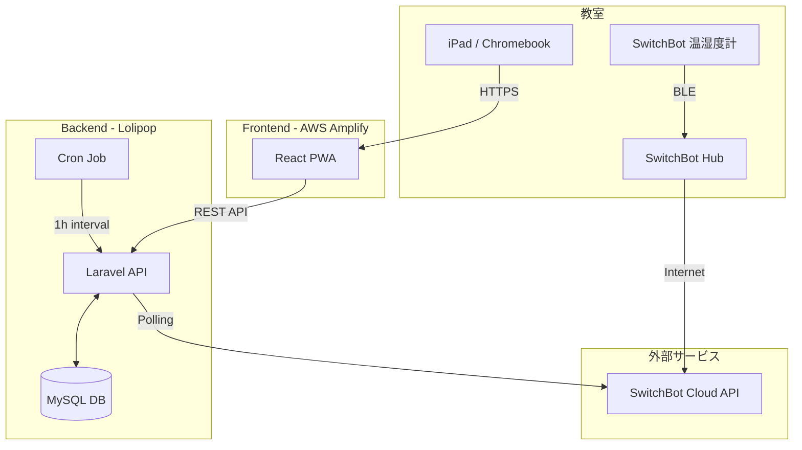

# 🌱 School Hydroponics Manager (Sprout)

## 📖 アプリケーション概要

教室に設置した水耕栽培キットの生育状況（室温・湿度・経過日数）を可視化し、**共有タブレット（iPad/Chromebook）** を通じて児童と先生が共に学び、探究するための教育用 Web アプリケーション（PWA）です。

2025年8月からインターナショナルスクールでの実証実験（PoC）運用を想定して開発されました。単なるデータ表示だけでなく、日々のクイズやToDo管理を通じて、児童が能動的に栽培に関わる仕組みを提供します。

### 主な特徴

* **リアルタイム環境モニタリング**: SwitchBotと連携し、教室の温度・湿度を自動取得して表示。
* **学習の定着**: 1日1問の日替わりクイズ機能で、知識の定着をサポート。
* **3D地球儀**: 地球環境への意識を高めるためのインタラクティブな3Dモデル表示。
* **クラス共有型UI**: 教室の電子黒板や共有iPadで見やすい、カード形式の直感的なデザイン。

---

## 📸 Demo / 画面イメージ


## 🛠 使用技術 (Tech Stack)

### Frontend

* **Language:** TypeScript
* **Framework:** React 19, Vite (PWA対応)
* **Libraries:**
* `react-router-dom`: ルーティング管理
* `recharts`: センサーデータのグラフ描画
* `react-three-fiber` / `drei`: 3Dモデル（地球儀）の描画
* `tailwindcss`: スタイリング
* `axios`: API通信


* **Hosting:** AWS Amplify

### Backend

* **Language:** PHP 8.x
* **Framework:** Laravel 10.x / 11.x
* **Database:** MySQL
* **Server:** Lolipop Rental Server (Standard Plan)

### IoT / External API

* **Device:** SwitchBot 温湿度計, SwitchBot Hub 2
* **API:** SwitchBot Cloud API v1.1

---

## 🏗 システム構成図

SwitchBotセンサーから収集したデータをLaravel経由でDBに蓄積し、Reactフロントエンドで可視化する構成です。



---

## ✨ 機能一覧

### 🧑‍🎓 ユーザー機能 (児童・先生)

1. **ダッシュボード表示**
* 現在の室温・湿度・適正判定
* 栽培開始からの経過日数
* バッジ獲得状況


2. **グラフ確認**
* 24時間 / 7日間のデータ切り替え


3. **学習機能**
* 日替わりクイズの出題と回答
* クラス単位でのスコア記録


4. **ToDo管理**
* 今週やるべきタスク（給水・水質チェック等）の完了管理


### 🛠 管理者機能

1. **クラス管理**
* クラスの新規作成、ログインコード発行


2. **デバイス連携**
* 教室ごとのSwitchBotデバイスID紐付け


3. **全体モニタリング**
* 全クラスの環境データ一覧表示


---

## 💻 環境構築 (Local Development)

### 1. リポジトリのクローン

```bash
git clone https://github.com/your-username/repository-name.git

```

### 2. バックエンド (Laravel)

```bash
cd backend
composer install
cp .env.example .env
# .env にDB接続情報とSWITCHBOT_TOKENを設定
php artisan key:generate
php artisan migrate --seed
php artisan serve

```

### 3. フロントエンド (React)

```bash
cd frontend
npm install
# .env に VITE_API_URL 等を設定
npm run dev

```

---

## 📝 運用・保守メモ

* **認証方式:** 児童が入力しやすいよう、パスワードレスの「クラスコード認証」を採用しています。
* **データ取得:** サーバー側のCron設定により、毎時0分にセンサーデータを自動取得しています。
* **3Dモデル:** `public/models/Earth.glb` に配置されたモデルデータを読み込んでいます。

---

## 📜 License

This project is licensed under the MIT License.
